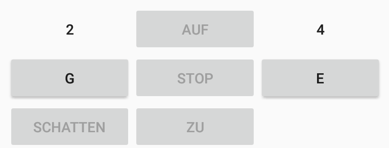
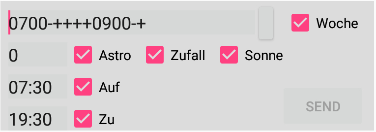
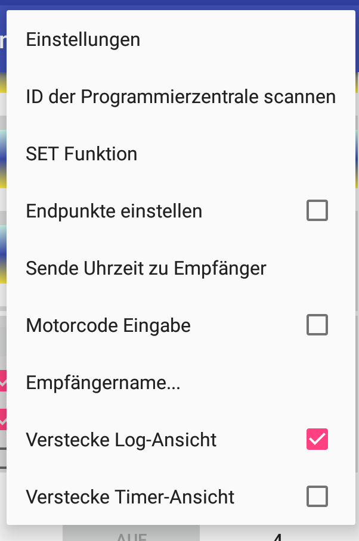

   <a href="README.md">English</a> |
    Deutsch

# tronferno-andro
Android GUI für [tronferno-mcu](https://github.com/zwiebert/tronferno-mcu)

### Installation und Bedienung

  * [Download](https://raw.githubusercontent.com/zwiebert/tronferno-andro/master/app/release/app-release.apk) the file app/release/app-release.apk to your Android device
  * Installiere die gedownloadete APK-Datei
  * Öffne die installierte Tronferno-App und öffne Menü.Einstellungen.Allgmein zur Eingabe der IP4-Adresse des Mikroprozessors Tronferno-MCU
  * Benötigt Tronferno-MCU weitere Konfiguration, kann diese über Menü.Einstellungen.Mikroprozessor-Einstellungen durchgeführt werden
  * Nun sollten nicht benötigte Gruppen bzw. Empfänger dekativiert werden im Menü.Einstellungen.Gruppen_und_Empfänger
  
### Funktionsumfang

Die Funktionen entsprechen mehr oder weniger der originalen Komfort-Programmierzentrale 2411:

* Steuern von Motoren (auf, zu, stopp, set, ...)
* Adressieren der Empfänger über die originalen Gruppen/Empfängernummern adressiert
* Programmierung der eingebauten Timer (Täglich, Wöchenntlich, Astro, Zufall) und der Optionen (Sonnenautomatik, ...)
* Konfiguration des Mikroprozessers über das Menü Einstellungen (Zeitzone, Längen/Breitengrad)
* Einscannen der ID der originalen Programmierzentrale um die App parallel dazu zu benutzen
* Setzen der Endpunkte des Rollladen (zur Sicherheit vor Beschädigungen wird dies durch einen Hardware-Knopf am Mikroprozessor gesteuert)
* Der Motorcode kann angesprochen werden 

### Usage

Die GUI ist noch nicht fertig entwickelt und kann sich noch ändern

---
 

Knöpfe in der unteren Hälfte des Bildschirms sind ähnlich zur Programmierzentrale 2411 angeordent:

 * G: Schaltet durch alle Gruppen-Nummern inklusive "A" für "alle Gruppen"
 * E: Schaltet durch alle Empfängernummern inkluse "A" für alle Empfänger der Gruppe
 * Auf/Stop/Zu: Sendet diese Kommandos zu den ausgewählten Empfänger-Nummern
 * Schatten: fährt zur gespeicherten Sonnen-Position. Aber nur wenn Sonnenautomatik aktiviert ist und der Rollladen oberhalb dieses Punktes steht.
---

 Der Timer-Bereich erlaubt die Konfiguarion der Timer und Optionen und die anschließende Datenübermittlung. Die Übermittlung geschieht immer als Block aller Timer und Optionen.
 Anders als bei der 2411 können Daten an ganze Gruppen oder auch alle Gruppen leichzeitig übermittelt werden.
  Abweichende Timer können dann anschließend für einzelene nachprogrammiert und überschrieben werden.
  
* Woche: Aktiviere Wochentags-Timer (ein Timer pro Wochentag möglich). Drücke kleinen Knopf links vom Häkchen um ein Editor-Fenster zu öffnen.
* Auf/Zu: Aktivieren des normalen täglichen Timers (Format: HH:MM z.B. 07:30)
* Astro: Aktiviere Timer der täglich zur zivilen Dämmerung den Rollladen schließt. Im Textfeld kann ein Minutenoffset (positv/egativ für später/früher) angegeben werden.
* Sonne:  Aktivere Sonnenautomatik um dem gepairten Funk-Sonnensor zu folgen (dies muss aktiv sein um den Schatten-Knopf benutzen zu können)
* Zufall: Aktiviert Zufalls-Timer (Öffnen und Schließen zu zufälligen Zeiten)
* Senden: Datenübermittlung durchführen zu allen ausgewählten Empfängern. Übermittlung dauert 5 Sekunden aufgrund der großen Menge an Daten aufgrund der Astro Funktion. Die adressierten Motoren quittieren den erfolgreichen Empfang mit kurzem Anlauf.
---

Positions-Anzeiger zeigen die aktuellen Position jedes Empfängers (soweit bekannt). Eine Zeile für jede nicht-leere Gruppe. Unbenutzte Empfänger sollten deaktiviert werden um die Übersichtlichkeit zu erhöhen (siehe Menü.Einstellungen.Gruppen_und_Empfänger).
Sollten nicht alle Gruppen auf den Bildschirm passen wird gescrollt. Durch Berührung eines Empfänger-Bildes kann dieser direkt (ohne Umweg über G/E-Tasten) ausgewählt werden. Es wird ein Name für jeden Empfänger angezeigt (Menü.Empfängername...)

---

Haupt-Menü:

 * Einstellungen: Konfiguration von App und Mikroprozessor hier
 * ID der Programmierzentrale scannen: starte den automatichen Scan zum ermitteln der Orginal-ID um Tronferno-MCU parallel zur alten Zentrale zu betreiben (Ein Empfänger kann nur einer Zentrale zugehören, also wird die ID der originalen Programmierzentrale mitbenutzt
 * Set Funktion: Aktiviert die Set Funktion, wenn der Set-Knopf nicht gedrückt werden soll oder kann. Dient zum Koppen von Sender und Empfängern.
 * Endpunkte einstellen: Aktiviert den Modus zum Endpunkte einstellen. Drücke Auf oder Zu. Dann drücke den Hardware-Knopf der an den Mikroprozessor angeschlossen werden muss. Bewege damit den Motor durch vorsichtiges mehrfaches drücken an den gewnünschen Endpunkt.
 Abschließend den Endpunkt mit STOP speichern. Sollte mit Motor-Code benutzt werden um Mehrfachaddressierung auszuschließen.
 * Uhrzeit zu Empfänger: Übermittle aktuelle Uhrzeit zu den ausgewählten Empfängern.
 * Motorcode Eingabe: zeigt ein Text-Feld über dem G-Knopf an wo ein Motorcode (oder auch eine andere gültige ID) eingegeben werden kann. Diese wird dann zur Adressierung benutzt, solange diese sichtbar ist. Drücken von G/E beendet die Verwendung des Motorcode.
 * Empfängername...: Namen vergeben um diese statt der Nummern in der Positionsanzeige zu benutzen.
 * Verstecke Log-Ansicht: Den Bereich für Diagnose-Ausgaben ausblenden 
 * Verstecke Timer-Ansicht: Den Bereich für Timer-Optionen und Senden-Knopf ausblenden

---
 