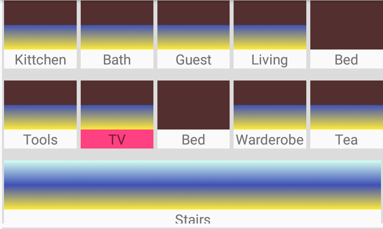
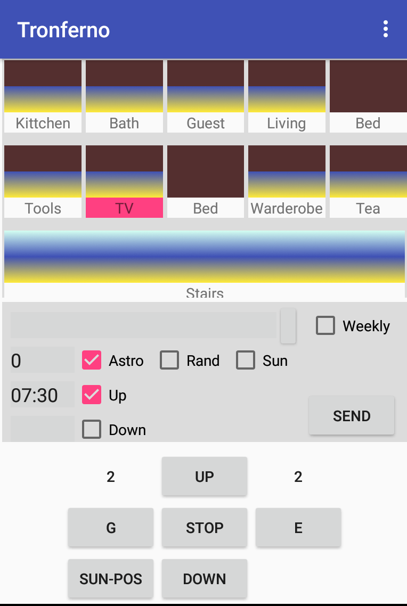

# tronferno-andro
Android GUI for [tronferno-mcu](https://github.com/zwiebert/tronferno-mcu)

### How to install and getting started

  * [Download](https://raw.githubusercontent.com/zwiebert/tronferno-andro/master/app/release/app-release.apk) the file app/release/app-release.apk to your Android device
  * Install the downloaded APK
  * Open the Tronferno App and go to Menu.Settings.General to configure the IP4-Address of your Tronferno-MCU
  * If Tronferno-MCU is not already configured you can do it now via Menu.Settings.MCU_Remote_Settings
  * Now disable unused Groups/Members via Menu.Settings.Groups_and_Members
  
### What it can do

You can do nearly all things you could do with original hardware Fernotron 2411 and some things more:

* control shutters (open, close, stop, set, ...)
* addresses shutters by original group/member numbers
* program and view internal shutter timers and options (daily, weekly, astro, random, sun automatic, ...)
* configure the MCU (timezone, longitude, latitude, ...)
* scan the ID of the original 2411
* set shutter upper and lower limit (to avoid possible damage, this feature requires a hardware button connected to the MCU)
* a motor code can be used to activate its pairing mode or to set shutter limits

### Usage

---
 

GUI buttons located in the lower half of the screen are similar to the original Control Unit 2411:

 * G: Cycles through all group numbers and "A" for all groups
 * E: Cycles through all groups members (motors/receivers) and "A" for all Members
 * UP/STOP/DOWN: Sends these commands to the selected motors/receivers
 * SUN-POS: moves the shutter to sun position if it has Sun-Automatic activated and a Sun-Position was stored

---

 Timer area contains some text-input fields and checkboxes to configure and send a timer. Timer data can only be sent as a whole block. So configure all options first before sending them to the receiver.

* Weekly: Check to activate weekly timer.  Press small edit button on the left of it to input the times via editor window
* Up/Down: Check one or both to activate daily timer and edit it (format: HH:MM)
* Astro: Check to activate closing shutter at civil dusk. A minute offset (positive or negative) can be entered to close N-minutes after or before civil dusk.
* Sun:  Check to follow a paired sun sensor (otherwise its ignored)
* Rand: Open/close shutters at random times
* Send: Press this to button to the timer data to the selected receiver. It takes 5 seconds to send. The motor will activate shortly to acknowledge receiving valid timer data.

---

Position Indicator shows status of each shutter of the selected group. You can click on each Shutter to select it directly. The label below each shutter shows its number or its name (names can be edited in menu).
Unused Shutter can be hidden by configuring the number of members of the group in settings menu.

---

The Menu:

 * Settings: configure the App and the MCU here
 * Main Controller Auto Set: starts a scan to find out the ID of your original 2411 unit
 * Set Function: activates "Set" mode for the selected receiver. This is (like the physical set button) used to pair transmitters to the receiver.
 * Set End Position: activates mode to adjust the motor to the upper and lower limit of the shutter.  Press UP or DOWN. Then press the hardware button (one or more times) to move the motor up or down to the end point. Then press STOP to save the end point. Should be used with a motor code make sure only a single motor is addressed.
 * Send RTC to Shutter: Send the current MCU time to the selected receiver(s).
 * Enter Motor Code: activates a textfield above the G button where a motor code (or any other valid ID) can be entered. As long as its visible, all commands will be sent there. If you press G or E button, it goes back to normal mode.
 * Edit Shutter Name: give the selected shutter a name. the names are showed under the related shutter position indicators
 * Hide Log View: hides the window logging mcu responses and debug info
 * Hide Timer View: hides the timer area of the GUI

---
 